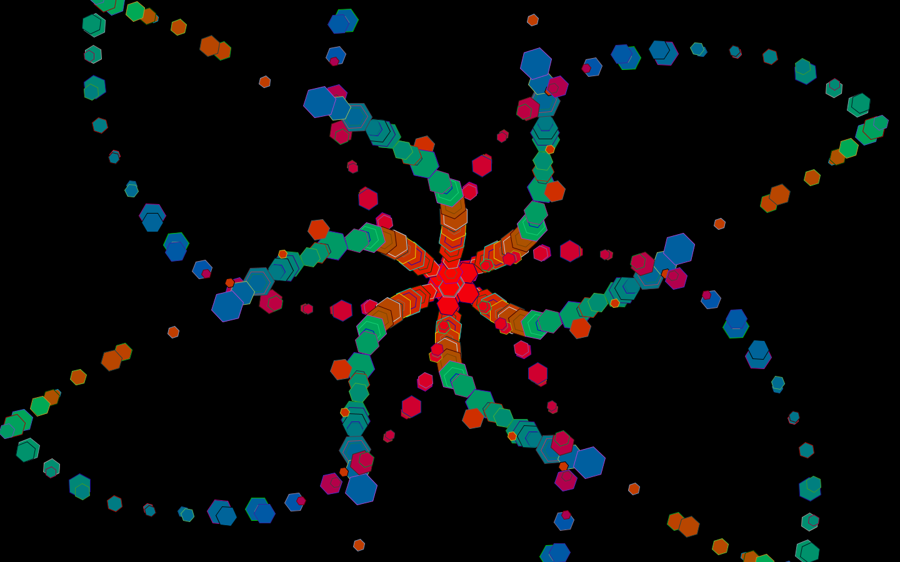

# welcome to my portfolio!
## 2018 projects

* dance projection visuals
* kaleidoscope drawing program

### visualization will be used in my school's dance concert
note: scaling is off in the embedding, shouldn't be collecting in the top left (can click to restart )

<canvas data-processing-sources= "particle_p/particle_proj.pde danceprojection/Particle.pde"
    style="display:block; margin-left:auto; margin-right:auto;"></canvas>

### this drawing program was my final project in AP Computer Science.
note: colors don't transfer exactly to this embedding.

<canvas data-processing-sources="Project/Project.pde Project/Polygon.pde Project/Ball.pde Project/Drawable.pde" style="display:block; margin-left:auto; margin-right:auto;"></canvas>
