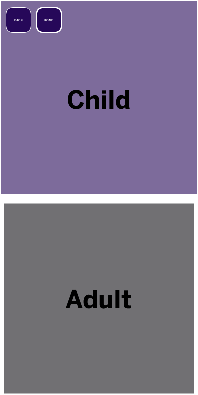
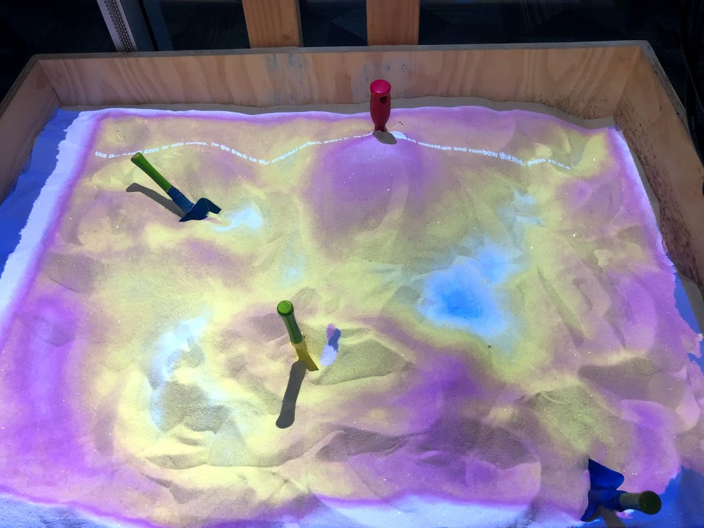

# Catherine Dickerman's Portfolio

## Honors Computer Science Projects 2018-2019 (11th Grade)

### Dance Projections
### CPR App
App made in partnership with Children's Hospital Los Angeles to walk through the basic steps of CPR for educational purposes.

<a href="https://kyrakraft.github.io/cprtrainingapp/" target="_blank">Web Version</a>

<a href="https://github.com/kyrakraft/cprtrainingapp" target="_blank">Code Repository</a>

### Topographic Sandbox
Program projects depth information collected by a Kinect Sensor onto sandbox, allowing users to manipulate the topography of the sand while the program reacts in real time.

<video width="800" height="600" controls>
<source src="pics/sandbox vid.mov" type="video/mov">
</video>

### visualizations used as a part of my school's dance concert, particles controlled movements of dancers tracked by a Kinect video sensor

<canvas data-processing-sources= "danceprojection/danceprojection.pde danceprojection/Particle.pde"
    style="display:block; margin-left:auto; margin-right:auto;"></canvas>

## AP Computer Science 2017-2018 (10th grade)

* Kaleidoscope Project

### This drawing program was my final project in AP Computer Science.

note: colors don’t transfer exactly to this embedding.

<canvas data-processing-sources="Project/Project.pde Project/Polygon.pde Project/Ball.pde Project/Drawable.pde" style="display:block; margin-left:auto; margin-right:auto;"></canvas>
