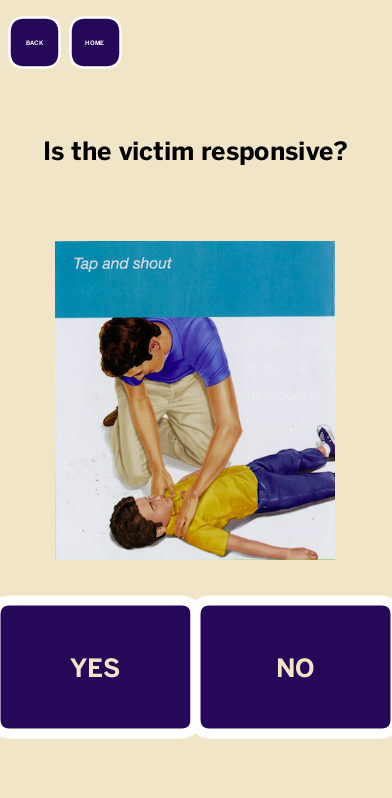

# Catherine Dickerman's CS Portfolio

## Honors Computer Science Projects 2018-2019 (11th Grade)

### Dance Projections
### CPR App
App made in partnership with Children's Hospital Los Angeles to walk through the basic steps of CPR for educational purposes.

<a href="https://kyrakraft.github.io/cprtrainingapp/" target="_blank">Web Version</a>

<a href="https://github.com/kyrakraft/cprtrainingapp" target="_blank">Code Repository</a>

### Topographic Sandbox
Program projects depth information collected by a Kinect Sensor onto sandbox, allowing users to manipulate the topography of the sand while the program reacts in real time.

<iframe width="560" height="315" src="https://www.youtube.com/embed/68YPFD68sAU" frameborder="0" allow="accelerometer; autoplay; encrypted-media; gyroscope; picture-in-picture" allowfullscreen></iframe>

### Dance Concert visualization
Two sets of visualizations used as background for pieces in the All School Dance Concert.

<a href="http://stem.marlborough.org/blog/dance-projections/" target="_blank">Click here to view an article featuring these programs.</a>

<canvas data-processing-sources="danceprojection_web/danceprojection_web.pde danceprojection_web/Particle.pde"></canvas>

## AP Computer Science 2017-2018 (10th grade)

* Kaleidoscope Project

### This drawing program was my final project in AP Computer Science.

note: colors don’t transfer exactly to this embedding.

<canvas data-processing-sources="Project/Project.pde Project/Polygon.pde Project/Ball.pde Project/Drawable.pde" style="display:block; margin-left:auto; margin-right:auto;"></canvas>
